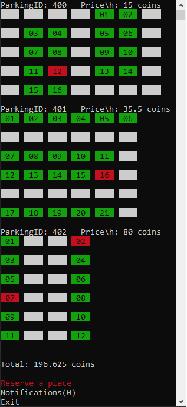

# Parking-System
Parking system simulation in console

Moving up and down in the menu with arrow keys.

Reserve a parking place by choosing its parking id, number and time.

A notification will show up 10 minutes before the time expire, in that menu you can extend its time.

There are three types of parking zones:
  1. Blue - price is 0 from 8:00 PM to 8:00 AM (first zone)
  2. Purple - price increase with 1.5 from 12:00 PM to 6:00 PM (second zone)
  3. Orange - price is double from 2:00 PM to 8:00 PM (third zone)

